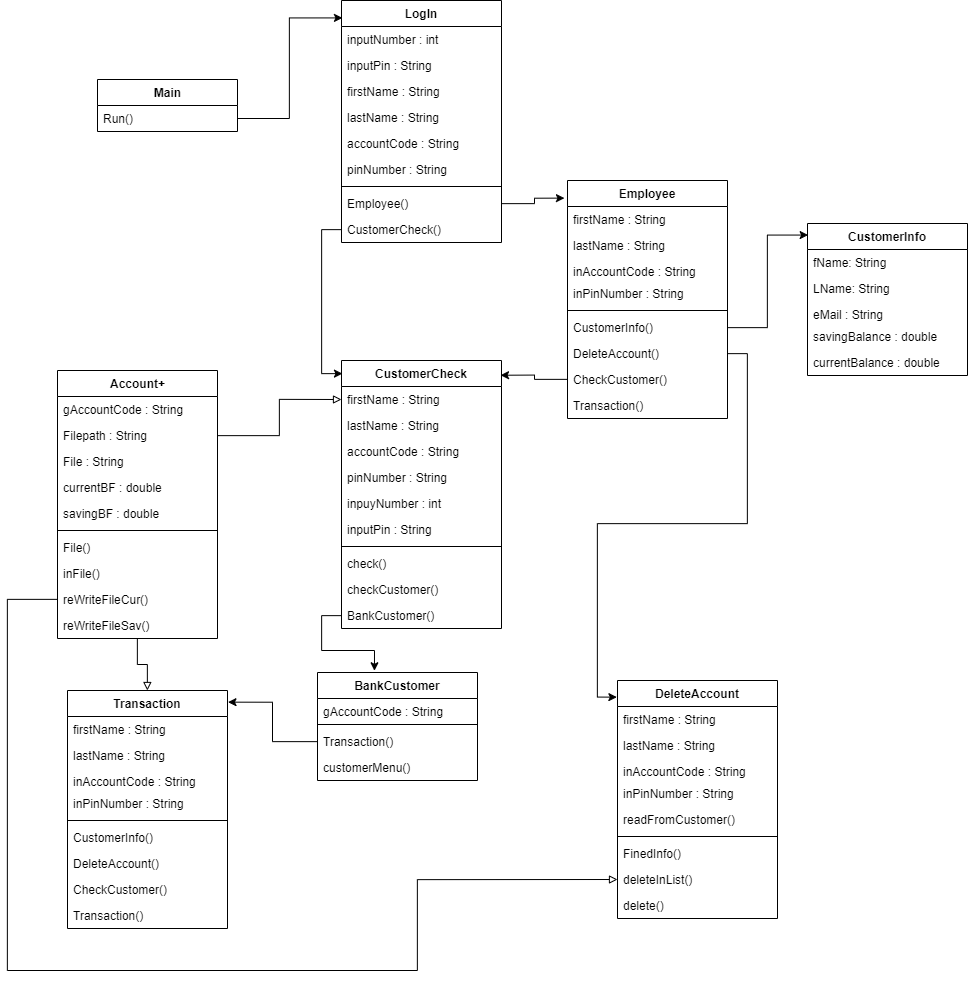
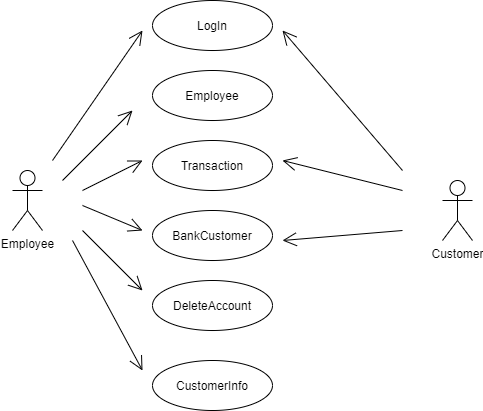
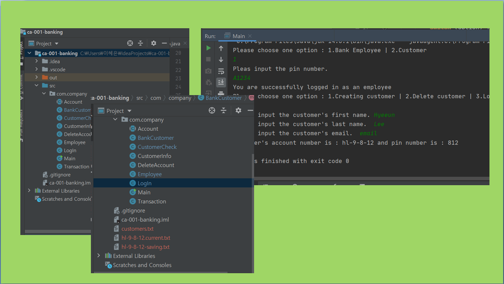
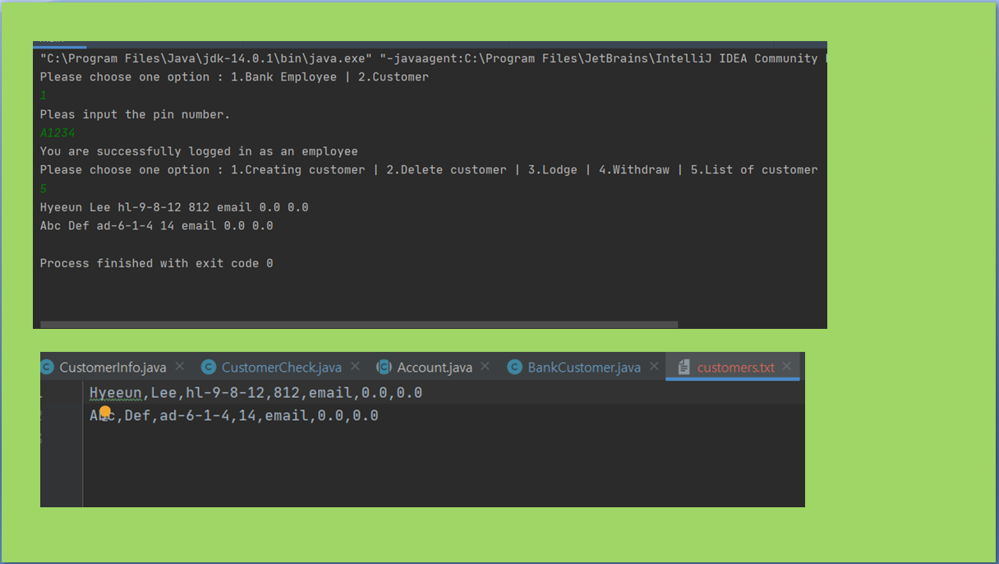
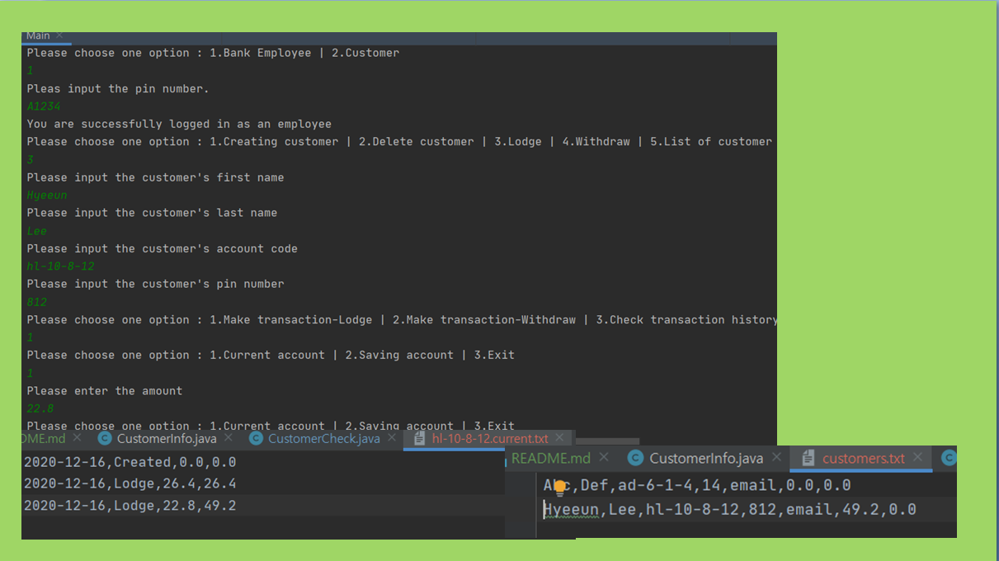
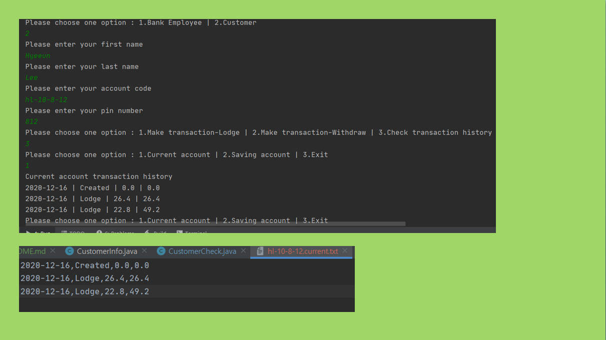

# Banking application / Hyeeun Lee
## Object-Oriented Programming - BSC20920 - Dorset College

## About the project

Console-based banking application for bank employee and customer.
As a bank employee can create the customer account - when the account created the current account and saving account will be created automatically - , can lodge and withdraw from either customers current account and saving account , can list of customers in console and delete customer account.
As a customer can check transaction history of current account and saving account and make transaction either current account and saving account.
All data will saved as txt file.
### UML class diagram

Account class is abstract class will extends to CustomerCheck class and Transaction Class.
This class is connect data to program that every function will work properly. 
### UML actor diagram

### How the program work - as employee

Employee need pin code to use program.
Employee can create account with customer first name, last name, email. When employee input thos information to program, CustomerInfo class will make account code and pin number and save in 'customer.txt' file. 
And program also create (account code).current.txt and (accont code)-saving.txt to save balance.

When employee ask to list of customer, the program will read from 'customer.txt' to console.

Employee can also delete account if they have only '0' balance in either current account and saving account.
The file will be deleted and program make another txt file that without customers data which employee would delete, and delete old 'customer.txt' file and change file new file name to 'customer.txt' in Account class.

Employee can make transaction either saving account and current account, and balance can not be negative. 
If Employee want to make transaction they need customer's first name, last name, account code, pin number. Program collect data from keyboard and check with data in CustomerChek class.
Data file will be changed same way to delete customer.

### How the program work - as customer

Customer need first name, last name, account code, pin number to use program. Collect those informations from customer, program matches with data from 'customer.txt' file.
If the information and data matched, Customer can add and subtract to current account and saving account. It will work same way as employee use function.
Customer also can see transaction history list, program will print data to console read from file in Account class.

